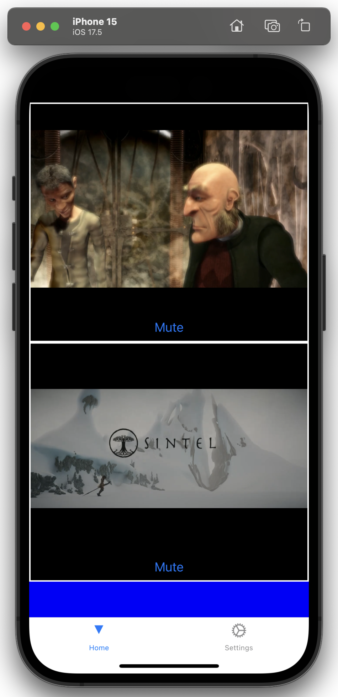

# Up

This document provides instructions on how to set up this repository and install Expo on iOS for testing.

## Repository Setup

1. Clone the repository:
    ```
    git clone https://github.com/MikeDafi/Up.git/
    ```
2. Navigate into the project directory:
    ```
    cd Up
    ```
3. Install the dependencies:
    ```
    npm install
    ```
4. Start the project:
    ```
    npx expo start
    ```

## Installing Expo on iOS

1. Open the App Store on your iOS device.
2. Search for "Expo Go" and install the app.
3. After installation, open Expo Go on your device.
4. Scan the QR code displayed in the terminal or in Expo Dev Tools when your project is running.

## Testing the Project via Expo Go

1. Ensure your iOS device and development machine are on the same network.
2. In the Expo Dev Tools, scan the QR code with the Expo Go app.
3. The app should now be running on your device.

## Testing the Project via Simulator

1. Ensure you have Xcode installed on your development machine.
2. Start the iOS simulator by running the following command in the terminal:
    ```
    xcrun simctl boot "iPhone 15"
    ```
    Replace `"iPhone 15"` with the name of the simulator you want to use.
3. In the Expo Dev Tools, click on "Run on iOS simulator" or press `i` in the terminal.
4. The app should now be running on the simulator.

## Example of App Running



## Troubleshooting

If you encounter `ReferenceError: ReadableStream is not defined`, it may be due to an incorrect Node.js version. To resolve this:

1. Ensure you have [nvm](https://github.com/nvm-sh/nvm) installed.
2. In the project directory, run:
    ```
    nvm use
    ```
   This will switch to the Node.js version specified in the `.nvmrc` file.

## Contributing
- Michael Askndafi