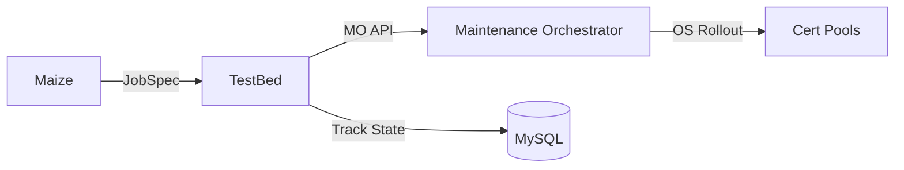
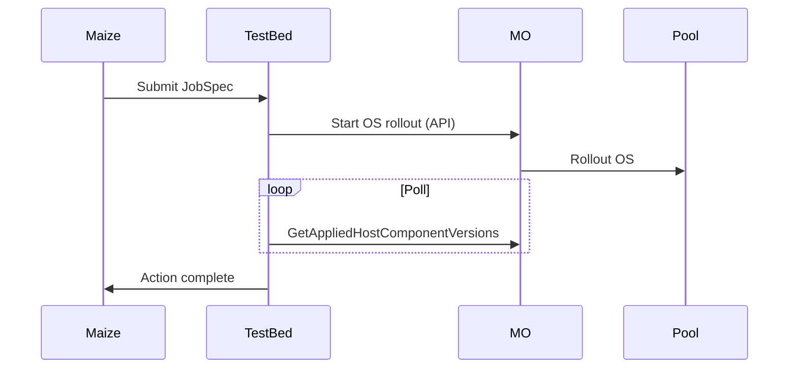

# OsOverrideAction for Maize

**Author:** Michael Askndafi | **Date:** January 2026 | **Status:** Draft

---

## Overview

OsOverrideAction enables OS version overrides on TestBed-managed certification pools for Maize OS snapshot validation.

**Key Decisions:**
- 10 certification pools per fabric
- Rollout via MO API (gradual, safer than immediate override)
- Fabric-specific pool fleets

---

## Architecture



**Flow:**
1. Maize submits JobSpec with OsOverrideAction to TestBed
2. TestBed calls MO API to start OS rollout
3. MO rolls out OS to nodes gradually
4. TestBed polls until rollout completes
5. Action completes

---

## Proto Definition & Parameters

```protobuf
message OsOverrideActionV1 {
  string os_version = 1;   // "azurelinux3-test-x86_64-r11"
}
```

| Parameter | Type | Required | Description |
|-----------|------|----------|-------------|
| os_version | string | Yes | OSSA snapshot version passed to MO |

Pool assignment is handled automatically by TestBed - users don't specify which pool.

**Example Job:**
```yaml
stages:
  - name: "os-override"
    actions:
      - name: "apply-maize-os"
        osOverrideAction:
          osVersion: "azurelinux3-test-x86_64-r11"
```

---

## MO Integration

TestBed calls MO's gRPC API to set OS version override and start rollout:

**API:** `MoHostVersion.SetComponentVersionOverride`
```protobuf
message SetComponentVersionOverrideRequest {
  ComponentOverrideTarget target = 1;  // pool_name
  HostComponent component = 2;         // HostComponent_OS
  ComponentVersion version = 3;        // os_version string
  Duration ttl = 4;                    // override expiration
}
```

**Completion:** TestBed polls `MoHostVersion.GetAppliedHostComponentVersions` until all nodes report target OS.

---

## Pool State Management (SQL)

**Pool Assignments:** Tracks active pool assignments. A job can hold multiple pools.
```sql
CREATE TABLE pool_assignments (
  cb_pool_name VARCHAR(128) PRIMARY KEY,
  job_run_id VARCHAR(64) NOT NULL,
  assigned_at TIMESTAMP NOT NULL
);
```

**Concurrency:**

Each action acquires a lock before calling MO, ensuring only one override runs at a time per pool:

```sql
BEGIN;
-- Lock the pool row (blocks other actions on same pool)
SELECT * FROM pool_assignments WHERE cb_pool_name = ? FOR UPDATE;

-- If no row exists, acquire the pool for this job
INSERT INTO pool_assignments (cb_pool_name, job_run_id, assigned_at)
VALUES (?, ?, NOW())
ON DUPLICATE KEY UPDATE job_run_id = job_run_id; -- no-op if same job

-- ... call MO, poll until complete ...

COMMIT; -- releases the lock, next action can proceed
```

- `FOR UPDATE` blocks other actions (same job or different job) until this action commits
- `INSERT` fails if another job owns the pool
- `DELETE FROM pool_assignments WHERE job_run_id = ?` releases all pools when job completes

**Pool Fleet:** `testbed-cert-pool-{1-10}-{fabric}` with `rampClass: CERTIFICATION`

---

## Maize Integration

Maize submits a TestBed JobSpec containing OsOverrideAction.

**Maize provides OS snapshot info:**
```json
{
  "snapshot": {
    "release": "azurelinux3-test-x86_64-r11"
  }
}
```

The `release` field maps to `os_version` parameter.

**Typical Maize Flow:**


---

## References

**TestBed:**
- [Validation TestBed - Design / API Spec](https://docs.google.com/document/d/1q6BxzEQug-XnOvlD5vyH6G4nwZghl0C8-N0QtlToKSA)
- [Validation TestBed - Node Pool Discussion](https://docs.google.com/document/d/1OsKBxnXshOBmnBN2q1rL00kwmNP51onfKpHzXGYHQg4)

**MO API (nimbus-api):**
- [MoHostVersion API Reference](https://github.com/linkedin-multiproduct/nimbus-api/blob/master/nimbus-api/docs/docs/api-reference/proto/mo/MoHostVersion.md) - `SetComponentVersionOverride`, `GetAppliedHostComponentVersions`
- [MoHostVersion.proto](https://github.com/linkedin-multiproduct/nimbus-api/blob/master/nimbus-api/nimbus-api/proto/mo/MoHostVersion.proto) - Proto definitions
- [HostComponent.proto](https://github.com/linkedin-multiproduct/nimbus-api/blob/master/nimbus-api/nimbus-api/proto/mo/HostComponent.proto) - `HostComponent_OS` enum

**Maize:**
- [Maize OS Snapshot Validation Docs](https://linkedin.atlassian.net/wiki/spaces/SOP/pages/495408798/Maize+OS+Snapshot+Validation)

